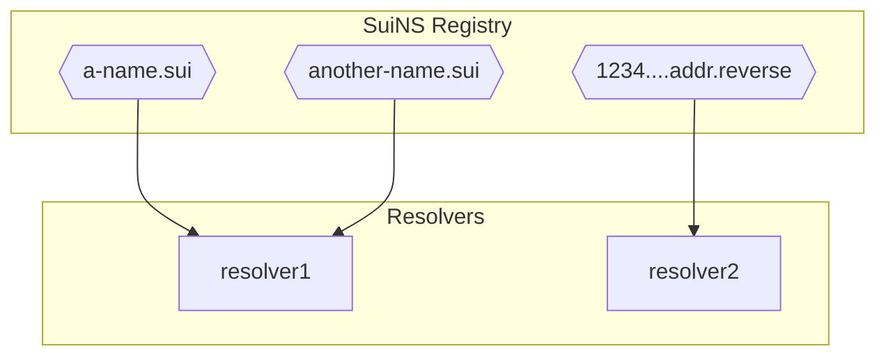
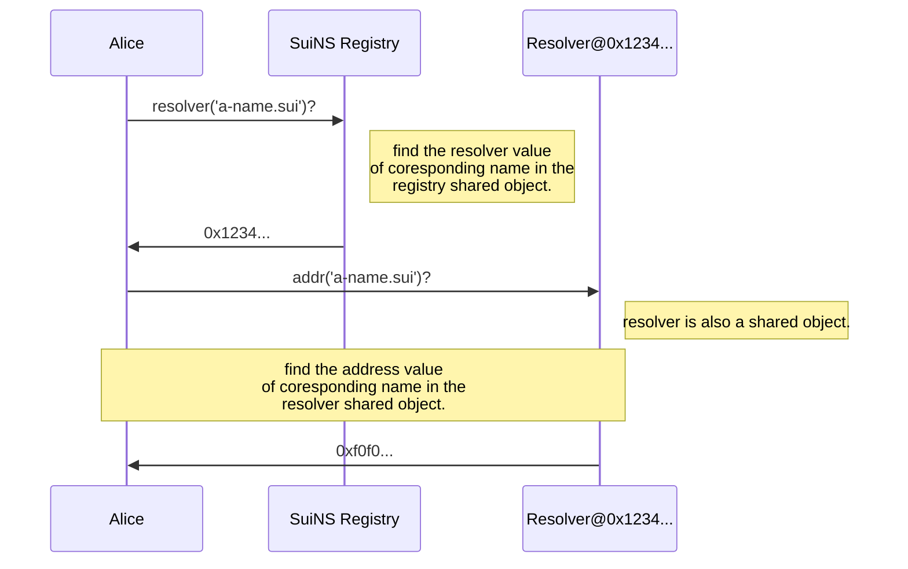
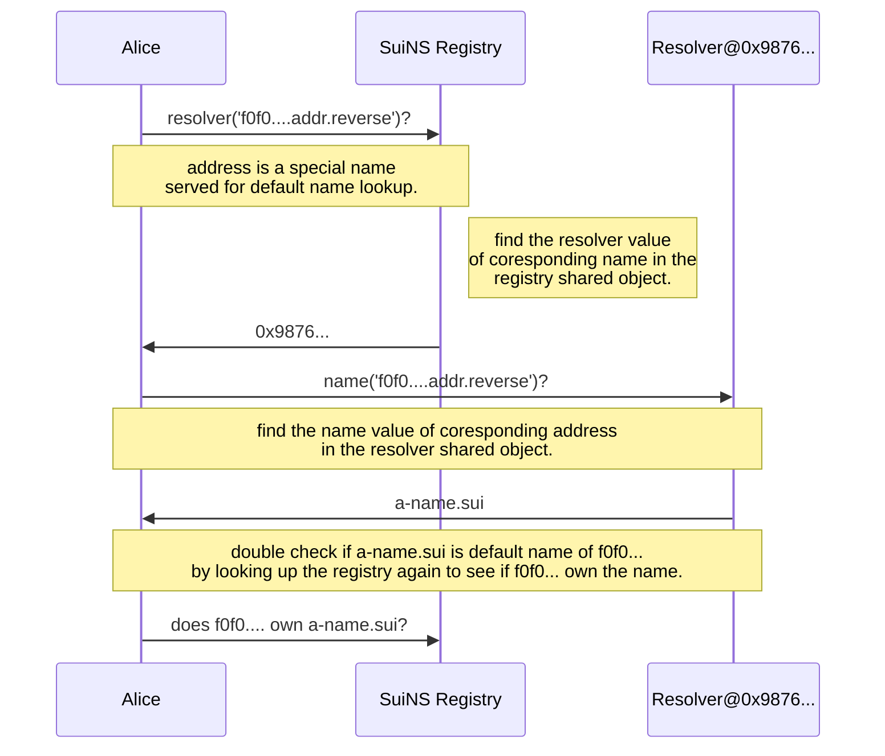

# SuiNS

SuiNS is a distributed naming system based on the Sui blockchain built with a set of smart contracts.

## Architecture



## Lookup for name



## Lookup for default name



## Contracts

On the contract publishing event, a `AdminCap` NFT is mint to the deployer address and transferable to anyone - only address holding this NFT can call admin features.

### Current contracts/objects:

- Package address: [0x21cca0f9b45dc6b76d582b5bdd6611411c49e8dd](https://explorer.devnet.sui.io/objects/0x21cca0f9b45dc6b76d582b5bdd6611411c49e8dd)
- Registry object: [0xac3927cc2cc977fb99ee7294f48d16c9f0b03c75](https://explorer.devnet.sui.io/objects/0xac3927cc2cc977fb99ee7294f48d16c9f0b03c75)
- Address resolver object [](https://explorer.devnet.sui.io/objects/)
- Name resolver object: [](https://explorer.devnet.sui.io/objects/)

#### Registry

A single source of truth maintaining a list of names records the owner, resolver, and TTL for each, and allows the owner of a domain to make changes to that data.

All SuiNS lookups start by querying the registry.

More details: [Registry Contract](./contracts/registry.md)

#### Registrar

Contains the core functionality of the permanent registrar.

More details: [Registrar Contract](./contracts/registrar.md)

#### Controller

Built on top of the registrar contract containing logics for name validation, prevent frontrunning. This is the entry point for registering a new name. The contract also maintains funds collected from name purchases, only address holds the SuiNS Admin NFT can withdraw the funds.

More details: [Controller Contract](./contracts/controller.md).

#### Resolver

Implements a general-purpose SuiNS resolver that is suitable for standard SuiNS use-cases (allowing user to set data for the name, e.g: address, name, etc).

More details: [Resolver Contract](./contracts/resolver.md).

## Interact with contract

To buy a name, it requires 2 smart contract calls:

- check sample [commitment.cjs](./sample/commitment.cjs).

```bash

PACKAGE_ADDR=
SUI_REGISTRAR=
​
BASE_CONTROLLER=
REGISTRY=
// first value of: `sui client addresses`
OWNER_ADDR=

SECRET='random string'
DOMAIN_NAME='a-name'
SUI_DOMAIN_NAME="$DOMAIN_NAME.sui"

COIN_ADDRESS=

// generate commitment
SUI_COMMITMENT=$(node ./sample/commitment.cjs $SUI_DOMAIN_NAME $OWNER_ADDR $SECRET);

// first transaction: make commitment to buy a name
sui client call --package $PACKAGE_ADDR --module base_controller \
    --function make_commitment_and_commit \
    --args $BASE_CONTROLLER $SUI_COMMITMENT --gas-budget 20000

// final transaction: actual request to buy the name
sui client call --package $PACKAGE_ADDR --module base_controller \
    --function register \
    --args $BASE_CONTROLLER $SUI_REGISTRAR $REGISTRY $CONFIGURATION $DOMAIN_NAME \
    $OWNER_ADDR 365 $SECRET $COIN_ADDRESS --gas-budget 20000
```

For details full open functions of our smart contracts, let's explore in each contract document itself.

---
